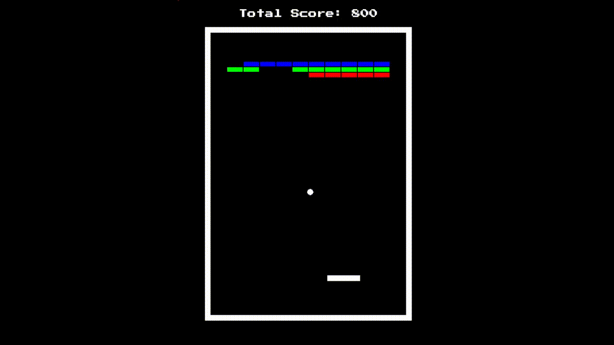

# Breakout

C++ clone of Atari's arcade game Breakout (1976).



## Installation

Add the following development libraries to your PATH environment variable, replacing `\path\to` as necessary:

```
C:\path\to\breakout\external\SDL2-2.0.18\lib\x64
C:\path\to\breakout\external\SDL2_mixer-2.0.4\lib\x64
C:\path\to\breakout\external\SDL2_ttf-2.0.15\lib\x64
```

Open **breakout.sln** in Visual Studio.

## License

[MIT](https://choosealicense.com/licenses/mit/)